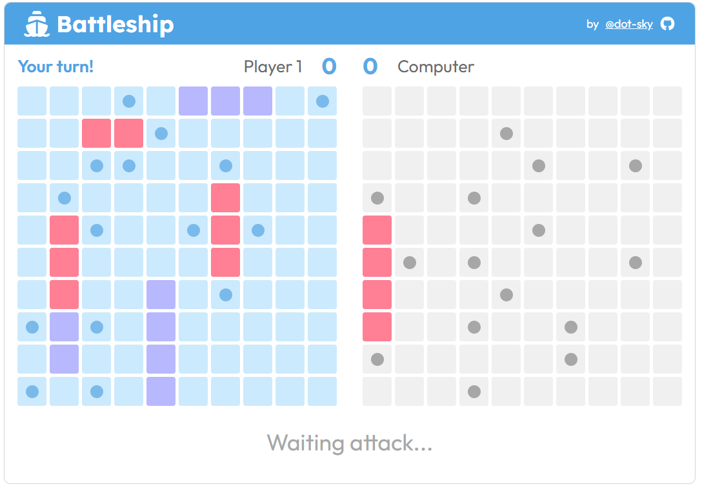

# Battleship

The classic Battleship game built with JavaScript, Webpack, and tested using Jest. Place your ships and sink the enemy fleet to win!



## Try it now

Click here to start playing: [https://dot-sky.github.io/battleship/](https://dot-sky.github.io/battleship/)

## Features

- **Two Game Modes**: Play against a friend or a smart computer opponent.
- **Flexible Ship Placement**: Drag, rotate, or randomly place your ships on the gameboard.
- **Responsive Gameplay Interface**: Visual feedback, score tracking, and custom player names.
- **Smart Computer**: The computer intelligently attempts to sink ships once it hits one.

## Tech Stack

- **JavaScript (ES6+)**
- **Webpack** for bundling
- **Jest** for unit testing

## Installation

To set up the project locally, follow these steps:

1. Clone the repository:

   ```sh
   git clone https://github.com/dot-sky/battleship.git
   cd battleship
   ```

2. Install dependencies:

   ```sh
   npm install
   ```

3. Start the development server:

   ```sh
   npm run dev
   ```

   This will launch the app in a local development environment with live-reloading enabled.

4. To run the tests:
   ```sh
   npm test
   ```

## Credits

- Uicons by [flaticon](https://www.flaticon.com/uicons)
